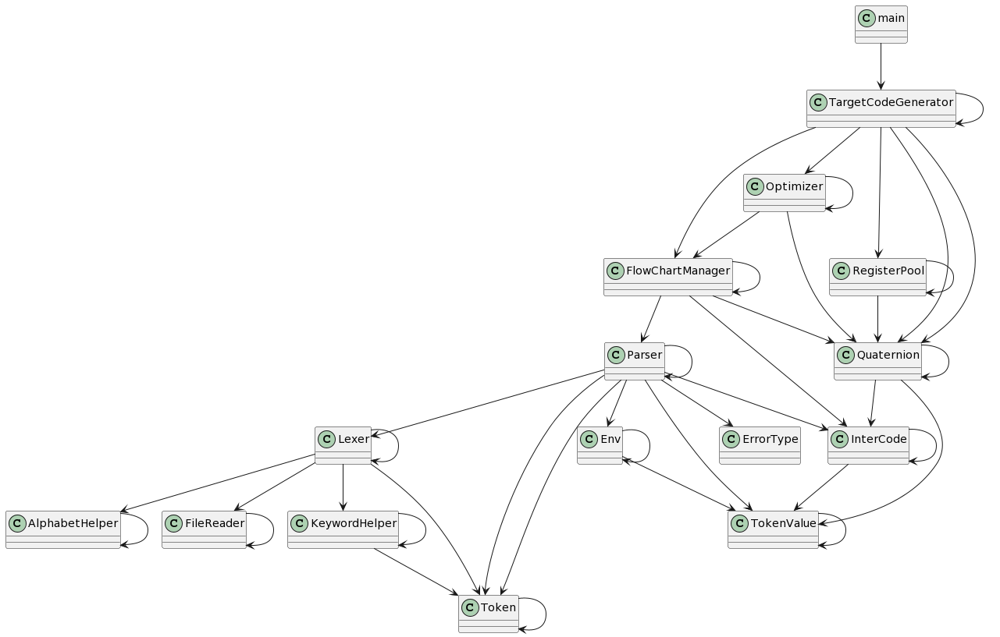

# A SysY Compiler

本项目为一简易的 SysY 到 MIPS 的编译器

## 编译器总体设计

### 总体结构

本编译器类间依赖图如下：


其中`Lexer`及其依赖的类负责词法分析，`FlowChartManager`及其依赖的类负责语法分析、语义分析以及中间代码生成，`TargetCodeGenerator`及其依赖的类负责目标代码生成、代码优化

本编译器整体结构呈线性，依赖方向单一

### 接口设计

1. **词法分析和语法分析**
	1. `Lexer` 类提供词法分析的接口，核心方法为 `NextToken()` 
	2. `Parser` 类进行语法分析，并依赖于 `Lexer`。它的核心方法为`Parse()` 。词法分析和语法分析是通过 `Lexer` 类生成的`token`和 `Parser` 类对这些`token`的消费来连接的
2. **`token`处理**
	1. `Token` 和 `TokenValue` 管理与`token`相关的数据。`Token` 包括用于检索`token`类型和值的方法，而 `TokenValue` 包括用于管理`token`值和属性的方法
3. **文件读取**
	1. `FileReader` 提供文件读取功能。核心方法为 `GetChar()` 和 `PutBack()` 
4. **符号表管理**
	1. `Env` 管理符号表，具有添加和检索`Token`的方法`TryPut()`以及`Get()`
5. **`utils`**
	1. `AlphabetHelper` 和 `KeywordHelper` 提供了一些常用函数，如识别字母、数字和关键词
6. **中间代码生成**
	1. `InterCode` 参与生成中间代码，具有添加和操作中间代码结构的核心方法`AddCode()`
7. **其他部分**
	1. `FlowChartManager`、`Optimizer`、`Quaternion` 和 `TargetCodeGenerator` ，中不存在公共接口，这些类要么位于顶层，要么仅仅作为数据容器存在

### 文件组织

本编译器源码文件结构如下：
```
.
├── CMakeLists.txt
├── include/
│   ├── AlphabetHelper.h
│   ├── Env.h
│   ├── ErrorType.h
│   ├── FileReader.h
│   ├── FlowChartManager.h
│   ├── InterCode.h
│   ├── KeywordHelper.h
│   ├── Lexer.h
│   ├── Optimizer.h
│   ├── Parser.h
│   ├── Quaternion.h
│   ├── RegisterPool.h
│   ├── TargetCodeGenerator.h
│   ├── Token.h
│   ├── TokenValue.h
├── src/
    ├── AlphabetHelper.cpp
    ├── Env.cpp
    ├── FileReader.cpp
    ├── FlowChartManager.cpp
    ├── InterCode.cpp
    ├── KeywordHelper.cpp
    ├── Lexer.cpp
    ├── Optimizer.cpp
    ├── Parser.cpp
    ├── Quaternion.cpp
    ├── RegisterPool.cpp
    ├── TargetCodeGenerator.cpp
    ├── Token.cpp
    ├── TokenValue.cpp
    ├── main.cpp
```

## 词法分析

### 设计

#### 文件读取

词法分析阶段，需要按字符逐一读取源码文件中的内容，每当读到的字符能够判定为一个`token`，就将其保存到`token`列表中。对于所有`token`，词法分析器均能通过向前看一个符号来识别它。词法分析器设计为不保存向前看符号，因此如果向前看符号是一个有用的符号（即属于下一个词法成分），则需要将这个符号放回（`PutBack`），因此文件读取类需要支持取出以及放回一个字符

#### `token`分割

词法分析阶段一共需要处理四大类符号，分别是：关键字及标识符、整数常量、字符串常量、运算符以及分号。其中关键字及标识符的文法特征相同，每当解析到一个关键字或标识符单词后，需要去关键字字典中进行查找，如果这个单词是关键字，则将其包装为关键字对应的`token`，否则包装为标识符

#### 注释及空白符处理

每当识别到一个`token`后，需要跳过其后的空白符号以及注释。由于空白符号以及注释可能会交替出现，因此需要循环处理二者，直至不能跳过更多字符为止

## 语法分析

### 设计

首先对文法进行修改，消除左递归：
```
编译单元 CompUnit → Decls FuncDefs MainFuncDef @<CompUnit>@
		Decls -> {Decl}
		FuncDefs -> {FuncDef}

声明 Decl → ConstDecl @<Decl>@ | VarDecl @<Decl>@

常量声明 ConstDecl → 'const' BType ConstDef ConstDeclTail ';' @<ConstDecl>@
		ConstDeclTail -> { ',' ConstDef }

基本类型 BType → 'int' @<BType>@

常数定义 ConstDef → Ident ConstDefTail '=' ConstInitVal @<ConstDef>@
		ConstDefTail -> { '[' ConstExp ']' }

常量初值 ConstInitVal → ConstExp @<ConstInitVal>@ | '{' [ ConstInitVal ConstInitValTail ] '}' @<ConstInitVal>@
		ConstInitValTail -> { ',' ConstInitVal }

变量声明 VarDecl → BType VarDef VarDeclTail ';' @<VarDecl>@
		VarDeclTail -> { ',' VarDef }

变量定义 VarDef → Ident VarDefTail @<VarDef>@ | Ident VarDefTail '=' InitVal @<VarDef>@
		VarDefTail -> { '[' ConstExp ']' }

变量初值 InitVal → Exp @<InitVal>@ | '{' [ InitVal InitValTail ] '}' @<InitVal>@
		InitValTail -> { ',' InitVal }

函数定义 FuncDef → FuncType Ident '(' [FuncFParams] ')' Block @<FuncDef>@

主函数定义 MainFuncDef → 'int' 'main' '(' ')' Block @<MainFuncDef>@

函数类型 FuncType → 'void' @<FuncType>@ | 'int' @<FuncType>@

函数形参表 FuncFParams → FuncFParam FuncFParamsTail @<FuncFParams>@
		FuncFParamsTail -> { ',' FuncFParam }

函数形参 FuncFParam → BType Ident ['[' ']' FuncFParamTail] @<FuncFParam>@
		FuncFParamTail -> { '[' ConstExp ']' }

语句块 Block → '{' BlockTail '}' @<Block>@
		BlockTail -> { BlockItem }

语句块项 BlockItem → Decl @<BlockItem>@ | Stmt @<BlockItem>@

语句 Stmt → 
LVal '=' Exp ';'  @<Stmt>@ 
| [Exp] ';' @<Stmt>@ 
| LVal '=' 'getint''('')'';' @<Stmt>@ 
| Block @<Stmt>@ 
| 'if' '(' Cond ')' Stmt [ 'else' Stmt ] @<Stmt>@ 
| 'for' '(' [ForStmt] ';' [Cond] ';' [forStmt] ')' Stmt @<Stmt>@ 
| 'break' ';' @<Stmt>@ 
| 'continue' ';' @<Stmt>@ 
| 'return' [Exp] ';' @<Stmt>@ 
| 'printf''('FormatString{','Exp}')'';' @<Stmt>@

语句 ForStmt → LVal '=' Exp @<ForStmt>@

表达式 Exp → AddExp @<Exp>@

条件表达式 Cond → LOrExp @<Cond>@

左值表达式 LVal → Ident {'[' Exp ']'} @<LVal>@

基本表达式 PrimaryExp → '(' Exp ')' @<PrimaryExp>@ | LVal @<PrimaryExp>@ | Number @<PrimaryExp>@

数值 Number → IntConst @<Number>@

一元表达式 UnaryExp → PrimaryExp @<UnaryExp>@ | Ident '(' [FuncRParams] ')' @<UnaryExp>@ | UnaryOp UnaryExp @<UnaryExp>@

单目运算符 UnaryOp → '+' @<UnaryOp>@ | '−' @<UnaryOp>@ | '!' @<UnaryOp>@

函数实参表 FuncRParams → Exp { ',' Exp } @<FuncRParams>@

乘除模表达式 %% MulExp → UnaryExp @<MulExp>@ | MulExp ('*' | '/' | '%') UnaryExp @<MulExp>@ %%
			MulExp -> UnaryExp @<MulExp>@ MulExpTail
			MulExpTail -> {('*' | '/' | '%') UnaryExp @<MulExp>@}

加减表达式 %% AddExp → MulExp @<AddExp>@ | AddExp ('+' | '−') MulExp @<AddExp>@ %%
			AddExp -> MulExp @<AddExp>@ AddExpTail
			AddExpTail -> {('+' | '−') MulExp @<AddExp>@}

关系表达式 %% RelExp → AddExp @<RelExp>@ | RelExp ('<' | '>' | '<=' | '>=') AddExp @<RelExp>@ %%
			RelExp -> AddExp @<RelExp>@ RelExpTail
			RelExpTail -> {('<' | '>' | '<=' | '>=') AddExp @<RelExp>@}

相等性表达式 %% EqExp → RelExp @<EqExp>@ | EqExp ('==' | '!=') RelExp @<EqExp>@ %%
			EqExp -> RelExp @<EqExp>@ EqExpTail
			EqExpTail -> {('==' | '!=') RelExp @<EqExp>@}

逻辑与表达式 %% LAndExp → EqExp @<LAndExp>@ | LAndExp '&&' EqExp @<LAndExp>@ %%
			LAndExp -> EqExp @<LAndExp>@ LAndExpTail
			LAndExpTail -> {'&&' EqExp @<LAndExp>@}

逻辑或表达式 %% LOrExp → LAndExp @<LOrExp>@ | LOrExp '||' LAndExp @<LOrExp>@ %%
			LOrExp -> LAndExp @<LOrExp>@ LOrExpTail
			LOrExpTail -> {'||' LAndExp @<LOrExp>@}

常量表达式 ConstExp → AddExp @<ConstExp>@
```

而后对于每一个产生式左部的文法符号，建立分析函数，构造递归下降分析器进行分析，每当一个分析函数运行至末尾，打印这个分析函数所对应的文法符号名，实现对解析过程的展示。所有与语法分析相关的函数均封装在`Parser`类中

## 错误处理

### 设计

#### 行号处理

对`token`的设计进行修改，对词法分析程序进行修改，记录每一个`token`所在的行号

#### 符号表的设计

##### 符号表表项的设计

符号名（`name:string`）

符号种类（`id_class:IdClass`）：变量、常量、函数

符号的维数（`id_dimension:int`）：`-1`（即`void`）、`0`、`1`、`2`

是否为常量（`is_const:bool`）

符号值（`values:vector<int>`）

符号的尺寸（`sizes:vector<int>`）

符号的参数表（`parameters:std::vector<TokenValue *>`）（仅当符号为函数时有意义）

符号地址（`address:unsigned int`）

##### 符号表的功能设计

符号表需要实现压栈（`push`）、弹栈（`pop`）、增、查四个功能

##### 环境（符号表）的`push`和`pop`

`push`的时机：`<Block>`的开头

`pop`的时机：`<Block>` 的末尾

##### 符号表的填充

所有可能引发“名字重定义”的地方就是需要填充符号表的地方，如下：
```
常数定义    ConstDef → Ident { '[' ConstExp ']' } '=' ConstInitVal
变量定义    VarDef → Ident { '[' ConstExp ']' }
    | Ident { '[' ConstExp ']' } '=' InitVal
函数定义    FuncDef → FuncType Ident '(' [FuncFParams] ')' Block
函数形参    FuncFParam → BType Ident ['[' ']' { '[' ConstExp ']' }]
```

#### 常量表达式求值

考虑到可能需要判定函数形参数组和实参数组的形状是否匹配，所以需要对数组的形状进行计算，即计算常量表达式。为了计算常量表达式，需要为与表达式解析相关的分析函数统一添加`result:int&`参数，表示存储表达式值的综合属性。由于常量表达式会产生加法表达式，所以其他的表达式也不得不获得相应的综合属性

因此，如果表达式暂时无法求值，无需对综合属性进行赋值，因为这个值一定不会被用到，只要保证常量表达式的求值是对的就可以。

对于非`Tail`的表达式，其参数为纯粹的综合属性。对于`Tail`，其参数同时担任综合属性和继承属性，这一点与属性翻译文法有所不同。

#### 错误处理

由于一行最多有一个错误，所以局部化处理的最低标准放宽到一行

错误分为三类：词法错误、语法错误以及语义错误，分类如下：

|错误名|错误类型|
|-|-|
|名字重定义|语义错误|
|未定义的名字|语义错误|
|函数参数个数不匹配|语义错误|
|函数参数类型不匹配|语义错误|
|无返回值的函数存在不匹配的return语句|语义错误|
|有返回值的函数缺少return语句|语义错误|
|不能改变常量的值|语义错误|
|printf中格式字符与表达式个数不匹配|语义错误|
|缺少分号|语法错误|
|缺少右小括号’)’|语法错误|
|缺少右中括号’]’|语法错误|
|在非循环块中使用break和continue语句|语法错误|
|非法符号|词法错误|

对于词法错误，在语法分析器分析道字符串常量`token`时，会遍历字符串常量中的字符，检查是否存在非法字符，对于词法错误无需特殊处理即可做到错误局部化

对于语法错误，在语法分析器执行`NextMatch()`函数（即检查当前符号类型是否匹配并读取下一个符号）的时候，如果遇到无法匹配的情况，则表明出现语法错误，此时不读取下一个符号即可做到错误局部化

对于语义错误，需要根据特征进行特定的处理。语义错误亦无需特殊处理即可做到错误局部化

## 代码生成

### 最终设计

#### 局部变量编址

在语法分析的过程中，我们可以为局部变量进行编址。由于局部变量存储在栈空间，故其绝对地址需要等到运行时才能确定。然而，我们可以在语法分析阶段确定局部变量的相对于当前栈帧基地址的地址

局部变量的相对地址设计为相对于当前栈帧底部的偏移字节数，不考虑函数返回地址等占用的空间

值得注意的是，在为函数参数编址的时候，我们希望函数参数紧密排列，这样在传参的时候会很方便。大部分情况下这不难，但是有一种极端情况，就是函数头中存在常量表达式，表达式会诱发中间变量的生成，这会破坏参数的紧密排列。因此，在处理常量表达式的时候，我们需要抑制中间代码的生成，这样也就不会产生中间变量了

#### 中间代码的设计

中间代码采用四元式表示：$(op,arg_1,arg_2,result)$

其中$op$为一枚举类型，枚举所有支持的符号

$op$的类型设计如下：
```C++
enum Operator{
	// 基本的算数运算
	ADD, // 加
	SUB, // 减
	MUL, // 乘
	DIV, // 除
	MOD, // 模
	POS, // 取原有值，其实就是啥也不做，可以直接优化掉
	NEG, // 取相反数
	// 布尔运算
	LSS, // 小于
	GRE, // 大于
	LEQ, // 小于等于
	GEQ, // 大于等于
	EQ, // 等于
	NEQ, // 不等于
	AND, // 且
	OR, // 或
	NOT, // 非
	// 变量赋值
	ASS, // 赋值
	// 引用
	REF, // ARRAY INDEX ADDR
	// 解引用
	LOAD, // ADDR _ T
	// 地址赋值
	STORE, // VALUE _ ADDR
	// 跳转
	BR, // 无条件跳转
	BRT, // 为真时跳转
	BRF, // 为假时跳转
	// 函数调用
	PARAM, // 传递参数
	CALL, // 调用函数
	// 函数返回
	RETVAL, // 有返回值的返回
	RET, // 无返回值的返回
}
```

$arg_1,arg_2,result$为两个操作数及存放结果的变量，它们有以下几种可能：
* 名字：指向符号表的指针
* 常量：一个整型数字
* 编译器生成的临时变量：一个整型数字
* 另一四元式的ID：一个整型数字

于是可以得出四元式类的属性设计如下：
```C++
class Quaternion{
  private:
	int id;
	enum Operator op;
	enum ItemType arg_left_type;
	enum ItemType arg_right_type;
	enum ItemType result_type;
	union ItemValue arg_left_value;
	union ItemValue arg_right_value;
	union ItemValue result_value;
}
```

$ItemType$的设计如下：
```C++
enum ItemType{
	NAME,
	IMM,
	TEMP,
	ID,
	STR // 专为打印语句使用
}
```

$ItemValue$的设计如下：
```C++
union ItemValue{
	long long value;
	TokenValue* name_value;
}
```

于是可以得到操作符的具体格式如下：
```TXT
{
	// 基本的算数运算
	ADD NAME/TEMP/IMM NAME/TEMP/IMM TEMP
	SUB NAME/TEMP/IMM NAME/TEMP/IMM TEMP
	MUL NAME/TEMP/IMM NAME/TEMP/IMM TEMP
	DIV NAME/TEMP/IMM NAME/TEMP/IMM TEMP
	MOD NAME/TEMP/IMM NAME/TEMP/IMM TEMP
	POS NAME/TEMP/IMM _ TEMP
	NEG NAME/TEMP/IMM _ TEMP
	// 布尔运算
	LSS NAME/TEMP/IMM NAME/TEMP/IMM TEMP
	GRE NAME/TEMP/IMM NAME/TEMP/IMM TEMP
	LEQ NAME/TEMP/IMM NAME/TEMP/IMM TEMP
	GEQ NAME/TEMP/IMM NAME/TEMP/IMM TEMP
	EQ NAME/TEMP/IMM NAME/TEMP/IMM TEMP
	NEQ NAME/TEMP/IMM NAME/TEMP/IMM TEMP
	AND NAME/TEMP/IMM NAME/TEMP/IMM TEMP
	OR NAME/TEMP/IMM NAME/TEMP/IMM TEMP
	NOT NAME/TEMP/IMM _ TEMP
	// 变量赋值
	ASS NAME/TEMP/IMM _ NAME
	// 引用
	REF NAME/TEMP NAME/TEMP/IMM TEMP // ARRAY INDEX ADDR
	// 解引用
	LOAD TEMP _ TEMP // ADDR _ T
	// 地址赋值
	STORE NAME/TEMP/IMM _ TEMP // VALUE _ ADDR
	// 跳转
	BR _ _ ID
	BRT NAME/TEMP/IMM _ ID
	BRF NAME/TEMP/IMM _ ID
	// 函数开始
	FUNC NAME _ _ // 一般函数开始
	MAIN _ _ _ // 主函数开始（导出后MAIN NAME _ _）
	// 函数调用
	PARAM NAME/TEMP/IMM _ _
	CALL NAME IMM TEMP
	// 函数返回
	RETVAL NAME/TEMP/IMM _ _ // 有返回值的返回 （导出后RETVAL NAME/IMM _ NAME）
	RET _ _ _ // （导出后RET _ _ NAME）
	// 输入输出
	GETINT _ _ TEMP
	PRINTF STR _ _ // 打印格式化符号
	PRINT NAME/TEMP/IMM _ _ // 打印单个数字
	// 扩展指令（用于辅助四元式或目标代码生成）
	BREAK // 循环中 break 的占位  
	CONTINUE // 循环中 continue 的占位  
	FORIT // for 循环修改循环变量语句的开始  
	PASS // 空语句，占位子用的（例如 FORIT 使用结束之后就改成这玩意占位）
	CONDEF NAME _ _ // 定义常量的位点
}
```

#### 中间代码的生成

##### 数组初始化

数组初始化的过程表示如下：
```
a[2][2] = {    {        1 ,          2     } , {      3 ,         4      }      };
			   ^        ^            ^         ^      ^           ^
			   |        |            |         |      |           |
			   REF      REF          REF       REF    REF         REF
		  <	                         InitVal                                    >
		       <      InitVal              >   <          InitVal        >
		             <Initval>   <Initval>        <InitVal>    <InitVal>
```
可以看出，第一次进入`InitVal`函数的时候是不需要产生`REF`动作的，所以需要进行一个特判；每次调用`InitVal`的时候，随后调用的`InitValTail`也都是和这个`InitVal`同一级别的，所以都需要`REF`同一个数组，只是`Index`不同

##### 短路求值

由于我将逻辑表达式当成普通表达式进行求值，所以我必须先将最初的一个逻辑表达式因子放到临时变量中，随后的逻辑表达式因子求值都累加到这个临时变量上。这样做会破坏单赋值形式，但是能够保证逻辑表达式求值正确

##### 数组与指针

数组与指针都是一种“高维”数据，同时也是一种“间接”数据

数组与指针唯一的区别在于，通过数组的地址，能够直接解引用得到其值，而对于指针，首先需要得到指针的值，再对指针的值进行解引用操作

因此，在符号表表项中加入`is_pointer:bool`属性，结合元素原本的维度，即可得到原符号的含义以及能够在其上进行的操作：

|is_pointer|维度|含义|操作|
|-|-|-|-|
|false|0|代表一个量|通过符号表可以知道这个量储存的地址，通过读取相应地址的内存信息即可得到这个量|
|false|大于0|代表一个相应维度的数组|通过符号表可以知道这个数组首元素的地址，通过对这个地址进行REF操作即可得到数组中每个元素的地址，而后可以得到数组中每个元素的值|
|true|0|代表一个地址|通过符号表可以知道这个符号的地址，通过读取相应地址的内存信息可以得到这个符号中存储的地址，而后可以对这个地址进行读写操作|
|true|大于0|代表一个相应维度的指针|通过符号表可以知道这个指针的地址，通过读取相应地址的内存信息可以知道这个指针指向的地址，而后可以对指向的地址进行REF操作，从而获得所指向的每一个元素的地址|

例如：
```
int a[2]={1,2}; // a is an array (is_pointer == false) and dimension of a is 1
REF a 0 b; // b is a pointer (is_pointer == true) and dimension of b is 0
LOAD b _ c; // c is an integer (is_pointer == flase) and dimension of c is 0

---分割线---
foo(int a[]){ // a is a pointer (is_pointer == true) and dimension of a is 1
	REF a 0 b; // b is a pointer (is_pointer == true) and dimension of b is 0
	LOAD b _ c; // c is an integer (is_pointer == flase) and dimension of c is 0
}

```

值得注意的是，对于数组进行一次REF操作，它就变成了指针（原因在于需要存储地址的值，所以需要相应的存储空间），另一方面，对数组和指针共享REF运算符

在代码生成的时候，我们需要对REF所操作的第一个操作数的`is_pointer`进行判断，从而生成对应的机器码。函数传参的时候如果PARAM后面是数组，那么需要将数组的地址传过去，如果是指针，那么需要将指针指向的地址传过去

#### 目标代码生成

原有的四元式承载了过多的属性，结构混乱。因此将原有的四元式导出为重新设计的四元式，最终的四元式指令如下：
```TXT
// 基本的算数运算
ADD INT_NAME/IMM INT_NAME/IMM INT_NAME
SUB INT_NAME/IMM INT_NAME/IMM INT_NAME
MUL INT_NAME/IMM INT_NAME/IMM INT_NAME
DIV INT_NAME/IMM INT_NAME/IMM INT_NAME
MOD INT_NAME/IMM INT_NAME/IMM INT_NAME
POS INT_NAME/IMM _ INT_NAME
NEG INT_NAME/IMM _ INT_NAME
// 布尔运算
LSS INT_NAME/IMM INT_NAME/IMM INT_NAME
GRE INT_NAME/IMM INT_NAME/IMM INT_NAME
LEQ INT_NAME/IMM INT_NAME/IMM INT_NAME
GEQ INT_NAME/IMM INT_NAME/IMM INT_NAME
EQ INT_NAME/IMM INT_NAME/IMM INT_NAME
NEQ INT_NAME/IMM INT_NAME/IMM INT_NAME
AND INT_NAME/IMM INT_NAME/IMM INT_NAME
OR INT_NAME/IMM INT_NAME/IMM INT_NAME
NOT INT_NAME/IMM _ INT_NAME
// 变量赋值
ASS INT_NAME/IMM _ INT_NAME
// 引用
REF INT_ARRAY_NAME/INT_POINTER_NAME INT_NAME/IMM INT_POINTER_NAME
// 解引用
LOAD INT_POINTER_NAME _ INT_NAME 
// 地址赋值
STORE INT_NAME/IMM _ INT_POINTER_NAME
// 跳转
BR _ _ LABEL
BRT INT_NAME/IMM _ LABEL
BRF INT_NAME/IMM _ LABEL
// 函数开始
FUNCDEF FUNC_NAME _ _ // 一般函数开始
MAIN FUNC_NAME _ _ // 主函数开始
// 函数调用
PARAM INT_NAME/INT_ARRAY_NAME/INT_POINTER_NAME/IMM _ _
CALL FUNC_NAME IMM INT_NAME
// 函数返回
RETVAL INT_NAME/IMM _ FUNC_NAME // FUNC_NAME为所属函数，可以获得栈帧大小
RET _ _ FUNC_NAME // FUNC_NAME为所属函数，可以获得栈帧大小
// 输入输出
GETINT _ _ INT_NAME
-PRINTF STR_NAME _ _- // 打印格式化符号（生成目标代码的时候，已经没这玩意了）
PRINT INT_NAME/IMM/STR_NAME _ _ // 打印
// 扩展指令（用于辅助四元式或目标代码生成）
PASS // 空语句，占位子用的
CONDEF INT_NAME/INT_ARRAY_NAME _ _ // 定义常量的位点
```

##### 全局变量综合

全局变量就是那些`if_global==true`的`IntItem`、`IntArrayItem`、`IntPointerItem`

它们会出现在四元式的任意一元中

为了能够给全局变量分配空间，我们会用到`.word`伪指令或`.space`伪指令，我们唯一需要知道的，就是哪个全局变量已经分配过空间，哪个全局变量没分配过

为此，我们可以从头到尾完整扫描一遍，记录一个“所有全局变量表”，按照`(address, QuaternionItem*)`的形式记录下每一个出现过的全局符号，如果是常量类型，由于我们有`CONDEF`，所以可以区分出来，剩下的随便用哪一个`item`都可以，只要知道它存在且占据了那块内存即可。值得注意的是，在这种逻辑下，未使用的变量不会被记录到“所有全局变量表”中，而这些未使用的变量也是需要分配内存的，否则会导致其后的变量初值的地址不对。所以，我们每给“所有全局变量”表中的变量（其实也有常量）分配空间的时候，都检查一下它前面有没有内存空隙，如果有，就用`.space`填上

此外，我们也把字符串常量存在全局区，使用`.asciiz`伪指令，随用随写就可以

##### 寄存器使用规范

| 寄存器编号 | 助记符 | 使用说明 |
|---|---|---|
|0|zero|永远返回0|
|1|at|汇编器的暂时变量|
|2-3|v0-v1|子函数调用返回值|
|4-7|a0-a3|子函数调用的参数|
|8-15(24-25)|t0-t7(t8-t9)|暂时变量，子函数使用时不需要保存和恢复|
|16-23|s0-s7|子函数寄存器变量，子函数必须保存和在返回之前恢复寄存器的值|
|26-27|k0-k1|通常被中断或异常处理程序使用作为保存一些系统参数|
|28|gp|全局指针，一些运行系统维护这个指针来更方便的存取static和extern变量(caller-saved)|
|29|sp|堆栈指针|
|30|fp|编译器的暂时变量|
|31|ra|子函数返回地址|

##### 内存模型

只需要关注全局区以及栈区

###### 全局区

利用全局变量综合环节得到的“所有全局变量表”，使用`.data`指令为全局变量申请内存，生成的代码实例如下：
```mips
.data
global_base:.word
0
1
2
0
103289
0
...
```

在使用全局变量的时候，首先将全局变量相对于`global_base`的偏移量加载到临时寄存器中，然后利用`lw $t1 label($t2)`和`sw $t1 label($t2)`指令即可进行变量的存取

###### 栈区

想要使用栈区，首先需要初始化栈指针，即使用`li $sp <stack_base>`指令进行对栈指针进行赋值，其中`<stack_base>`为栈的基地址

栈的生长方向为从高地址到低地址，而栈帧的使用方向为从低地址到高地址，具体来说，如果一个局部变量的相对地址为`16`，那么想要取得这个变量的值，只需要`lw $t1 16($sp)`即可

每当进行函数调用时，调用者负责压栈，即执行`subi $sp $sp <calee.frame_size>`，当返回时，被调用者负责弹栈，即执行`addiu $sp $sp <calee.frame_size>`

##### 寄存器池的实现

寄存器池需要完成三个最基本的操作，一个是分配，一个查询，还有一个是溢出。对外部只需要有两个操作，一个是分配并返回寄存器，另一个是离开基本块溢出全部变量

实现上，我们构造一个名为寄存器对象的对象，代表存在寄存器里面的东西。寄存器对象有三种：全局变量、局部变量以及立即数。在分配的时候，如果是变量，传入寄存器对象相对地址，如果是立即数，那就直接传值（我们并不需要传入变量的类型，因为寄存器能存储的空间是固定的，所以数据类型没什么意义）

值得注意的是，寄存器池的使用是一个动态的过程，也就是说，我们在使用寄存器池的时候要考虑到当前栈指针的位置是否正确，并且需要保证寄存器中的数据种类正确（例如：我们为一个立即数分配了一个寄存器，那么我们不应把它作为结果寄存器，因为如果我们把它作为结果寄存器，寄存器池并不知道这件事，在寄存器池眼中，这个寄存器存放的仍是原来的那个立即数，这会导致下一次为这个立即数分配寄存器时，寄存器池直接返回原来那个寄存器，而不真正通过`li`分配），而这种正确性由使用者保证

另一方面，我们约定在四元式中只会向符号中写结果，这就意味着，我们在生成目标码的时候也只需要向符号对应的寄存器（或者被当作临时寄存器的寄存器`$fp`）写结果

下面介绍分配、溢出这些对象的方法

**全局变量**

分配：
```mips
li $ti <global.address>
lw $ti global_base($ti)
```

溢出：
```mips
li $fp <global.address>
sw $ti global_base($fp)
```

**局部变量**

分配：
```
lw $ti <local.address>($sp)
```

溢出：
```
sw $ti <local.address>($sp)
```

**立即数**

分配：
```
li $ti <imm>
```

溢出：
```
什么也不用做
```

##### 运算的目标码生成

本节我们解决以下四元式：
```TXT
// 基本的算数运算
ADD INT_NAME/IMM INT_NAME/IMM INT_NAME
SUB INT_NAME/IMM INT_NAME/IMM INT_NAME
MUL INT_NAME/IMM INT_NAME/IMM INT_NAME
DIV INT_NAME/IMM INT_NAME/IMM INT_NAME
MOD INT_NAME/IMM INT_NAME/IMM INT_NAME
POS INT_NAME/IMM _ INT_NAME
NEG INT_NAME/IMM _ INT_NAME
// 布尔运算
LSS INT_NAME/IMM INT_NAME/IMM INT_NAME
GRE INT_NAME/IMM INT_NAME/IMM INT_NAME
LEQ INT_NAME/IMM INT_NAME/IMM INT_NAME
GEQ INT_NAME/IMM INT_NAME/IMM INT_NAME
EQ INT_NAME/IMM INT_NAME/IMM INT_NAME
NEQ INT_NAME/IMM INT_NAME/IMM INT_NAME
AND INT_NAME/IMM INT_NAME/IMM INT_NAME
OR INT_NAME/IMM INT_NAME/IMM INT_NAME
NOT INT_NAME/IMM _ INT_NAME
```

首先从寄存器池中取出操作数以及结果所对应的寄存器。对于`ADD`、`SUB`、`POS`、`NEG`运算，只需一条语句，即可完成对应运算，对于`MOD`、`MUL`、`DIV`运算，需要使用`mfhi/mflo`指令来获取运算结果，对于布尔运算，指令的映射如下：

**LSS**

```
LSS t2 t3 t1 ->
	slt t1 t2 t3
```

**GRE**

```
GRE t2 t3 t1 ->
	slt t1 t3 t2
或
GRE t2 t3 t1 ->
	sgt t1 t2 t3
```

**LEQ**

```
LEQ t2 t3 t1 ->
	slt t1 t3 t2
	ori at zero 1
	subu t1 at t1
或
LEQ t2 t3 t1 ->
	sle t1 t2 t3
```

**GEQ**

```
GEQ t2 t3 t1 ->
	slt t1 t2 t3
	ori at zero 1
	subu t1 at t1
或
GEQ t2 t3 t1 ->
	sge t1 t2 t3
```

**EQ**

```
EQ t2 t3 t1 ->
	subu t1 t2 t3
	ori s8 zero 1
	sltu t1 t1 s8
或
seq t1 t2 t3
```

**NEQ**

```
NEQ t2 t3 t1 ->
	subu t1 t2 t3
	sltu t1 zero t1
或
sne t1 t2 t3
```

**AND**

```
AND t2 t3 t1 ->
	sltu t1 zero t2
	sltu s8 zero t3
	and t1 t1 s8
```

**OR**

```
OR t2 t3 t1 ->
	or t1 t2 t3
	sltu t1 zero t1
```

**NOT**

```
NOT t2 _ t1 ->
	li t1 1
	sltu t1 t2 t1
```

##### 赋值、地址赋值、引用、解引用的目标码生成

本节我们解决以下四元式：
```
// 变量赋值
ASS INT_NAME/IMM _ INT_NAME
// 引用
REF INT_ARRAY_NAME/INT_POINTER_NAME INT_NAME/IMM INT_POINTER_NAME
// 解引用
LOAD INT_POINTER_NAME _ INT_NAME 
// 地址赋值
STORE INT_NAME/IMM _ INT_POINTER_NAME
```

其中每条四元式都有多种情况，接下来分别讨论：

**ASS   INT_NAME/IMM   -   INT_NAME**

这个简单，直接从寄存器池中取出相应的变量或者立即数，进行一个`move`即可

**REF   INT_ARRAY_NAME/INT_POINTER_NAME   INT_NAME/IMM   INT_POINTER_NAME**

首先从寄存器池中取出`arg_right`以及`result`，然后对`arg_left`进行讨论，如果`arg_left`是`INT_ARRAY_NAME`，则将其基地址加载到寄存器中，如果`arg_left`是`INT_POINTER_NAME`，则从寄存器池中取出`arg_left`

根据`INT_ARRAY_NAME/INT_POINTER_NAME`的`axes`属性计算出其在当前维度上进行引用所需要跨越的内存大小`<unit_size>`，利用`mul`和`mflo`指令计算出偏移量，将运算结果加到上个步骤中存放地址的寄存器中，再将得到的和存放到`result`所对应的寄存器中

以`arg_left == INT_ARRAY_NAME(local)`为例，设存放`arg_right`的寄存器为`ti`，存放`result`的寄存器为`tj`：
```mips
li $tj <unit_size>
mul $ti $tj
mflo $tj
addu $tj $tj <name.address>
addu $tj $sp $tj
```

再以`arg_left == INT_ARRAY_NAME(global)`为例，设存放`arg_right`的寄存器为`ti`，存放`result`的寄存器为`tj`：
```mips
li $tj <unit_size>
mul $ti $tj
mflo $tj
addu $tj $tj <name.address>
la $fp global_base
addu $tj $fp $tj
```

再以`arg_left == INT_POINTER_NAME`为例，设存放`arg_left`的寄存器为`th`，`arg_right`的寄存器为`ti`，存放`result`的寄存器为`tj`：
```mips
li $tj <unit_size>
mul $ti $tj
mflo $tj
addu $tj $th $tj
```

**LOAD   INT_POINTER_NAME   _   INT_NAME**

设存放`arg_left`的寄存器为`th`，存放`result`的寄存器为`tj`：
```mips
lw $tj 0($th)
```

**STORE   INT_NAME/IMM   _   INT_POINTER_NAME**

和`LOAD`差不多

##### 跳转的目标码生成

本节我们解决以下四元式：
```
// 跳转
BR _ _ LABEL
BRT INT_NAME/IMM _ LABEL
BRF INT_NAME/IMM _ LABEL
```

由于跳转需要`LABEL`，所以在进入每个基本块的时候，都产生一个标签，大致如下：
```MIPS
...
BK3:
(若干指令)
BK4:
(若干指令)
...
```

对于无条件跳转当然就是直接`b`就行了，对于有条件跳转，使用`bnez`和`beqz`即可，值得注意的是，跳转之前，需要清空寄存器池，来保存这个基本块中修改过的变量，这和`CALL`之前的清空寄存器池是一个道理

事实上，对于以跳转结尾的基本块，只需要在跳转语句前清空一次寄存器池就可以了。当前的代码逻辑会在块结尾处再清空一次，其实是多余的（因为跳转语句不会写寄存器，只要不写寄存器，就没必要写回，只有写了寄存器，才需要写回）

##### 函数开始的目标码生成

函数开始也需要生成一个标签，标签为函数名

##### 函数调用的目标码生成

本节我们解决以下四元式：
```
// 函数调用
PARAM INT_NAME/INT_ARRAY_NAME/INT_POINTER_NAME/IMM _ _
CALL FUNC_NAME IMM INT_NAME
```

临时变量不会跨越表达式赋值，这点很重要。这就意味着每个参数表达式的结果变量在求值之后直到其入栈时都不会被改变

所以函数调用的时候，只需要在发现`CALL`语句之后，向上寻找对应的`PARAM`，并将参数存入栈中

值得注意的是，在调用函数的时候，需要将调用者的返回地址保存起来，那么理想的保存位置就是栈，于是选择将其保存至栈帧中`+0`的位置，因此符号表在为变量编址的时候，如果是局部变量，从`+4`开始编

当压栈以及保存返回地址都进行完毕，那么只需清空寄存器池，修改栈指针，跳转，下为一例：
```MIPS
# step.1 传参
sw $t1 (-<callee.framesize>+<callee.param_num>*4)($sp)
sw $t3 (-<callee.framesize>+<callee.param_num>*4-4)($sp)
...
# step.2 保存返回地址
sw $ra 0($sp)
# step.3 清空寄存器池
sw $t0 <var0.address>($sp)
sw $t1 <var3.address>($sp)
...
# step.4 保存返回地址
sw $ra 0($sp)
# step.5 压栈
sub $sp $sp <callee.framesize>
# step.6 跳转
jal <callee>
# step.7 恢复返回地址
lw $ra 0($sp)
```

同时，我们约定返回值存放在`v0`寄存器，所以最后还有一步：
```MIPS
# step.8 接收返回值
move $v0 $ti # ti为存放返回值的临时变量所对应的寄存器
```

##### 函数返回的目标码生成

函数返回时，首先将返回值放入`$v0`寄存器，清空寄存器池，然后恢复栈指针，返回：
```MIPS
move $ti $v0
# 清空寄存器池
...
# 恢复栈指针
addiu $sp $sp <current.framesize>
# 返回
jr $ra
```

##### 输入输出的目标码生成

本节我们解决以下四元式：
```
// 输入输出
GETINT _ _ INT_NAME
-PRINTF STR_NAME _ _- // 打印格式化符号（生成目标代码的时候，已经没这玩意了）
PRINT INT_NAME/IMM/STR_NAME _ _ // 打印
```

`GETINT`需要首先为存放结果的变量分配一个寄存器，然后通过`syscall`将需要读入的数字读入`v0`，最后再将`v0`移动到存放结果变量的寄存器，下为一例：
```
li $v0 5
syscall
addiu $ti $v0 0
```

`PRINT` 需要首先判断打印的是字符串还是数字，下面各举一例

字符串：
```
.data
str10987342:.asciiz "hello"
.text
la $a0 str10987342
li $v0 4
syscall
```

数字：
```
addiu $a0 $ti 0
li $v0 1
syscall
```

##### 扩展指令的目标码生成

本节我们解决以下四元式：
```
PASS // 空语句，占位子用的
CONDEF INT_NAME/INT_ARRAY_NAME _ _ // 定义常量的位点
```

首先是`PASS`语句，由于其啥用没用，一个`nop`即可

其次是常量定义位点，首先判断是不是全局常量，如果是全局常量那就不用管，否则生成一系列的赋值语句，大致如下：
```
li $v0 0
sw $v0 (+k)($sp)
...
```

## 代码优化

### 设计

#### 寄存器池优化（其一）

在原有的设计中，寄存器池在为变量分配寄存器时一定会生成`load`，而在溢出变量的时候一定会生成`store`，这两个过程均有优化空间，本节将会对其进行一些最基本的优化，这些优化不依赖于其他前序优化工作

##### 对分配的优化

在为一个对象分配寄存器时，如果此次分配后将会立即写入这个对象，那么就不需要进行`load`操作，例如在为如下四元式中的变量`a`分配寄存器时，就不需要生成`load`操作：
```
a = b + 1;
```

##### 对溢出的优化

在溢出一个对象时，如果这个对象自从分配以来从未被写过，那么就不需要进行`store`操作，例如在下面这个基本块中，溢出变量`a`的寄存器时，就不需要写回：
```
b = a + 1;
print(a);
c = b + a;
return a;
```

##### 实现与分析

为了实现上述操作，在分配寄存器时，我们增加一个参数`is_def:bool`，如果这个参数为真，则表示此次分配的变量即将被定义，如果为假，则表示此次分配的变量即将被使用，该参数的默认值为假。同时，我们为寄存器对象类增添一个属性`write_back:bool`，这个变量记录了这个寄存器对象在其生命周期内有无被写入，如果被写入，则需要写回，该属性为真

值得注意的是，在一条四元式内，一个变量可能同时被定义与使用，然而，这种情况下使用一定先于定义，所以在处理每一条四元式的时候，需要保证申请寄存器的顺序符合实际情况

不过，我们不妨假设真的搞错了顺序，会导致什么后果：
* 假如同一个变量先定义后使用，却先为“使用”申请了寄存器，那么无非是多一个`load`操作，其正确性不会有问题
* 假如同一个变量先使用后定义，却先为“定义”申请了寄存器，那么就丢失了一个`load`操作，目标代码逻辑就不正确了

所以，我们只需要保证为每条四元式分配寄存器时，把为结果变量的分配放到最后面，就足以保证正确性

#### 寄存器池优化（其二）

在原有的寄存器池实现中，没有考虑到全局寄存器的分配。此处采用引用计数策略对全局寄存器进行分配

实现上，代码优化器会扫描所有的整数变量，并对其每一次引用进行加权计数，并按照权重从大到小依次分配全局寄存器

全局寄存器共有`8`个，为`s0~s7`，被分配到全局寄存器的变量的四元式元的`if_regitster`域会置为真，并且`regitser_id`域将会得到相应的寄存器编号

#### 冗余语句删除

对于代码的执行来说，有些语句是冗余的

例如，对于如下代码：
```
a = 1
b = 1
t1 = a + b
t2 = a * 2
t3 = b - t2
bne a b L1
print a
b L2
L1:
print b
L2:
print "Hello"
```

可以看出，`t1, t2, t3`都没有被用到，对其进行赋值的语句也没有任何意义。因此上述代码可以优化为：
```
a = 1
b = 1
bne a b L1
print a
b L2
L1:
print b
L2:
print "Hello"
```

如何识别并删除这些冗余代码呢？首先我们需要识别出“被用到”的变量。值得注意的是，在这里我们只讨论整数变量，对于数组或者指针的赋值我们一律认为其有用，不去删除。对于我们最终版本的四元式而言，以下语句能够直接判定其中变量是“有用”的：
```
// 引用
REF INT_ARRAY_NAME/INT_POINTER_NAME INT_NAME/IMM INT_POINTER_NAME
// 地址赋值
STORE INT_NAME/IMM _ INT_POINTER_NAME
// 跳转
BRT INT_NAME/IMM _ LABEL
BRF INT_NAME/IMM _ LABEL
// 函数调用
PARAM INT_NAME/INT_ARRAY_NAME/INT_POINTER_NAME/IMM _ _
// 函数返回
RETVAL INT_NAME/IMM _ FUNC_NAME // FUNC_NAME为所属函数，可以获得栈帧大小
// 输入输出
GETINT _ _ INT_NAME
PRINT INT_NAME/IMM/STR_NAME _ _ // 打印
```

如果一个变量被判定为有用的，则所有出现了这个变量的四元式中可能改变这个变量的其他变量都会被认为是有用的。具体来说，对于基本算术运算、布尔运算、变量赋值，如果有用变量出现在结果的位置上，那么这个四元式中所有变量都是有用的

最后，对于基本算术运算、布尔运算、变量赋值、解引用，如果结果位置上的变量是无用的，我们便可以将这条语句直接删除
